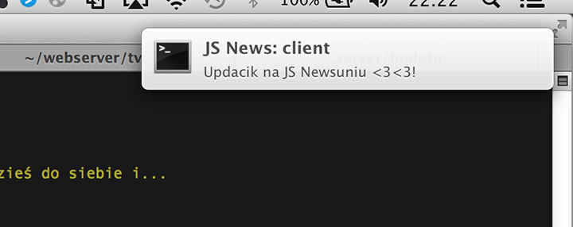
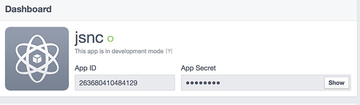
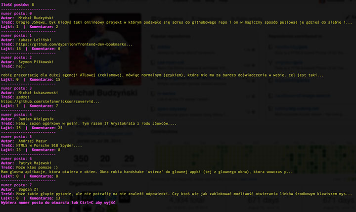

JS News: Client by [Michał Budzyński](https://github.com/michalbe)
=============

[JS News](https://www.facebook.com/groups/217169631654737/) is a Polish JavaScript group on Facebook, created by [Damian Wielgosik](https://twitter.com/varjs) & [Kamil Trebunia](https://twitter.com/KamilTrebunia). With 2,100+ active users it's best place in Polish internet to discuss everything related to Fronend development. And since it's mostly (only?) for Polish speaking developers, rest of this README will be in PL.

---
### Co? ###
JS News: Client to oparty na node.js, commandlineowy klient do Waszej ulubionej fejsbukowej grupy - [JS News](https://www.facebook.com/groups/217169631654737/) . Umożliwia on przeglądanie postów i komentarzy bez uruchamiania przeglądarki, oraz informuje w czasie rzeczywistym o updatach poprzez systemowe notyfikacje.

### Co nowego? ###
Changelog:

  * v 1.1.0 (:elephant: _hannibal_) - 24 czerwca 2014, autor: [ Michał Maćkowiak](https://github.com/chemikpil):
    * Możliwość przechodzenia pomiędzy grupami zdefiniowanymi w configu
    * Moduł inputu zmienony z readLIne na [inquire](https://www.npmjs.org/package/inquirer)
    * Growl zmieniony na [node-notifier](https://www.npmjs.org/package/node-notifier) (od OS X 10.8 notyfikacje systemowe + wsparcie dla Win i Linuxa)
    * Notyfikacja informuje tylko o nowych postach (nie o lajkach i komentarzach), [Issue #34](https://github.com/michalbe/jsnews-client/issues/34)
    * Możliwość obserwowania wybranych postów - dostają one notyfikacje o każdym lajku i komentarzu (uwaga na [Bug #33](https://github.com/michalbe/jsnews-client/issues/33))
    * Kolory można teraz zmienić w pliku `config.js`

### Jak? ###
Aby uruchomić JS News: Client należy:
  *  Stworzyć swój plik `config.js` w katalogu `/src/`. Można wykorzystać do tego plik `config.js.example` zamieszczony w tym samym katalogu.
  *  Do poprawnego działania potrzebujemy facebookowych kluczy - prywatnego i publicznego. Przepraszam, ale nie chciało mi się bawić w serwerowe zagadnienia (nie udaję nawet że umiem), najprościej więc będzie stworzyć nową aplikację [TUTAJ](https://developers.facebook.com/), następnie `APPS` -> `Create New` i wygenerować dla niej klucze (całość powinna trwać około 2.5 sec)
  
  *  Dependencje `npm`. W katalogu głównym aplikacji odpalamy `npm install`.
  *  Uruchamiamy z linii komend poprzez `node index.js`
  *  Cieszymy się, bawimy i radujemy.

### Czemu? ###
Czy jesteś znudzony tłumaczeniem swoim współpracownikom i przełożonym że większość czasu na Facebooku spędzasz dyskutując o JavaScriptowych problemach, rozwiązaniach, projektach i pomysłach, i w żadnym wypadku nie jest to prokrastynacja? Robiąc to samo w terminalu cały czas wyglądasz jakbyś pracował :)!

### Co dalej? ###
Wiele jeszcze zostało do zrobienia. Lista bugów i proponowanych ficzerów [znajduje się tutaj](https://github.com/michalbe/jsnews-client/issues?state=open). Proste poprawki, które nie powinny zająć więcej niż kilkadziesiąc minut (idealne aby rozpocząć przygodę z oprogramowaniem open source!) oznaczone zostały flagą [good-first-issue](https://github.com/michalbe/jsnews-client/issues?labels=good-first-issue&page=1&state=open).
Jeśli masz czas i chęć rozwijać projekt, zapraszam (**dla każdego kto wyląduje rozsądny Pull Request w `masterze` darmowy bilet na tegoroczny [onGameStart](http://onGameStart.com)**)

